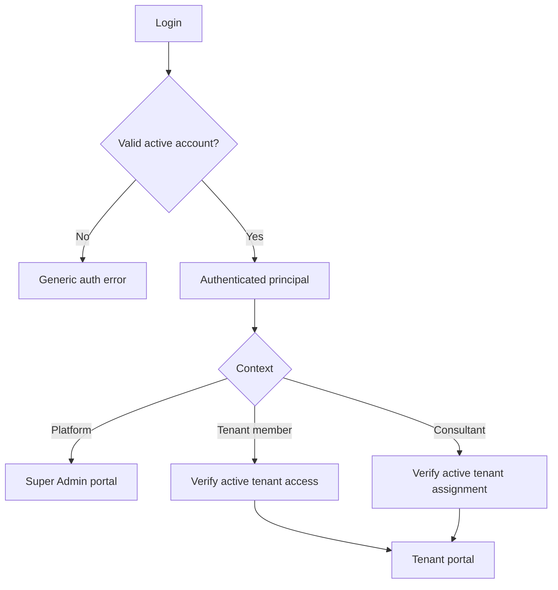
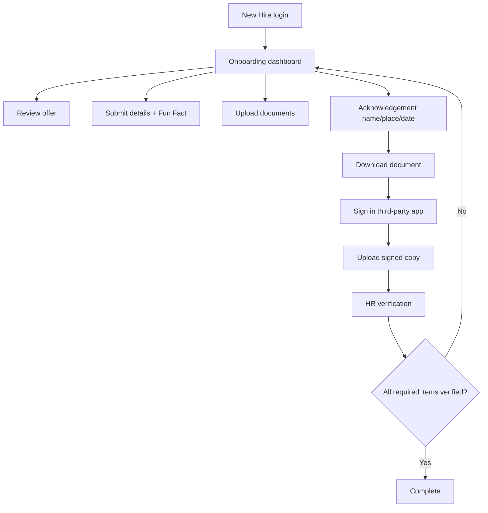
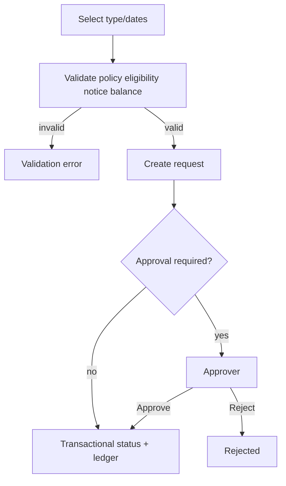
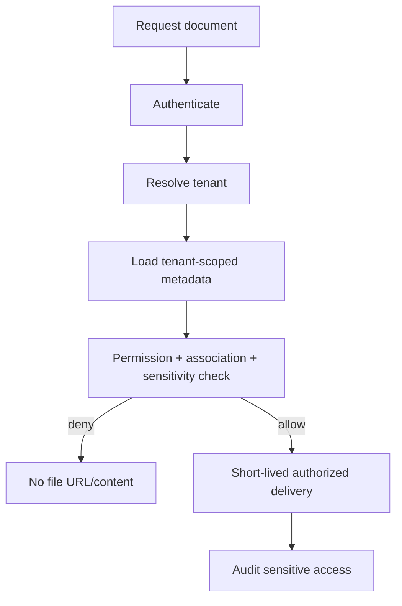
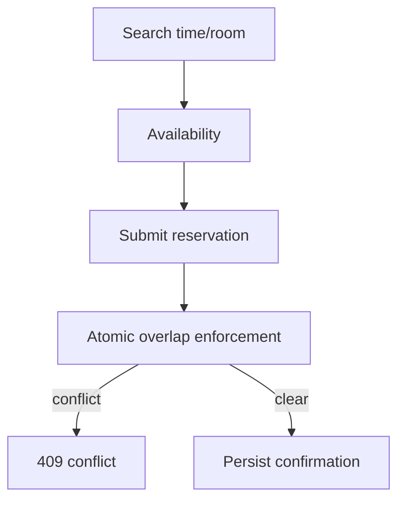

# User Flows

## Purpose
Define important cross-screen and cross-service workflows.

## Authentication and tenant context

```mermaid
flowchart TD
 A[Login] --> B{Valid active account?}
 B -- No --> X[Generic auth error]
 B -- Yes --> C[Authenticated principal]
 C --> D{Context}
 D -->|Platform| E[Super Admin portal]
 D -->|Tenant member| F[Verify active tenant access]
 D -->|Consultant| G[Verify active tenant assignment]
 F --> H[Tenant portal]
 G --> H
```

## Onboarding

```mermaid
flowchart TD
 A[New Hire login] --> B[Onboarding dashboard]
 B --> C[Review offer]
 B --> D[Submit details + Fun Fact]
 B --> E[Upload documents]
 B --> F[Acknowledgement name/place/date]
 F --> G[Download document]
 G --> H[Sign in third-party app]
 H --> I[Upload signed copy]
 I --> J[HR verification]
 J --> K{All required items verified?}
 K -- Yes --> L[Complete]
 K -- No --> B
```

## Leave

```mermaid
flowchart TD
 A[Select type/dates] --> B[Validate policy eligibility notice balance]
 B -- invalid --> C[Validation error]
 B -- valid --> D[Create request]
 D --> E{Approval required?}
 E -- yes --> F[Approver]
 F -->|Approve| G[Transactional status + ledger]
 F -->|Reject| H[Rejected]
 E -- no --> G
```

## Document download

```mermaid
flowchart TD
 A[Request document] --> B[Authenticate]
 B --> C[Resolve tenant]
 C --> D[Load tenant-scoped metadata]
 D --> E[Permission + association + sensitivity check]
 E -- deny --> F[No file URL/content]
 E -- allow --> G[Short-lived authorized delivery]
 G --> H[Audit sensitive access]
```

## Room reservation

```mermaid
flowchart TD
 A[Search time/room] --> B[Availability]
 B --> C[Submit reservation]
 C --> D[Atomic overlap enforcement]
 D -- conflict --> E[409 conflict]
 D -- clear --> F[Persist confirmation]
```
