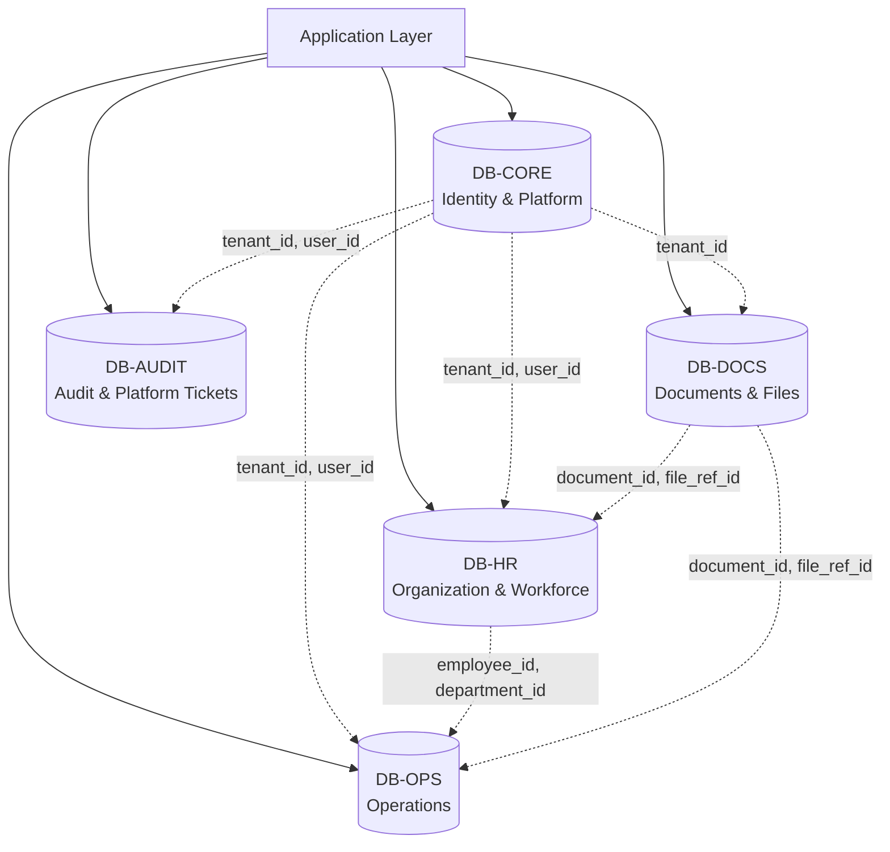

# Database Architecture

## Purpose

Define persistence principles, multi-database topology, cross-database patterns, and failure isolation for tenant-safe transactional HRMS data.

## Multi-Database Topology

The HRMS platform uses **5 independent databases** to achieve fault isolation and module-level independence. Each database has its own connection pool, migration versioning, and backup schedule.

Dotted lines represent **application-enforced logical references** (no SQL FK constraints across databases).

## Database Assignments

| Database | Tables | Purpose |
|---|---|---|
| **DB-CORE** | `users`, `tenants`, `tenant_settings`, `tenant_subscription_plans`, `tenant_user_memberships`, `roles`, `permissions`, `role_permissions`, `user_role_assignments`, `consultants`, `consultant_tenant_assignments`, `auth_sessions`, `auth_refresh_tokens`, `password_reset_tokens`, `account_activations` | Identity, authentication, authorization, tenant lifecycle |
| **DB-HR** | `regions`, `departments`, `designations`, `employees`, `employee_groups`, `employee_group_memberships`, `employee_bank_details`, `employee_emergency_contacts`, `employee_work_history`, `employee_education`, `employee_skills`, `tenant_custom_fields`, `employee_custom_field_values`, `new_hires`, `onboarding_cases`, `onboarding_tasks`, `offer_letters`, `acknowledgements` | Organization structure, employee records, onboarding |
| **DB-DOCS** | `documents`, `document_versions`, `document_associations`, `file_storage_references`, `document_access_tokens`, `document_access_log` | Document metadata, file storage references, access control |
| **DB-OPS** | `leave_types`, `leave_policies`, `leave_policy_targets`, `leave_balances`, `leave_ledger_entries`, `leave_requests`, `leave_request_actions`, `holidays`, `flexible_holiday_selections`, `attendance_records`, `attendance_events`, `attendance_corrections`, `overtime_requests`, `kb_categories`, `kb_articles`, `kb_article_versions`, `kb_tags`, `kb_article_tags`, `kb_department_visibility`, `announcements`, `announcement_targets`, `announcement_reads`, `ticket_categories`, `tickets`, `ticket_comments`, `ticket_activities`, `buildings`, `floors`, `meeting_rooms`, `room_facilities`, `room_reservations`, `notification_templates`, `notification_queue` | Leave, attendance, KB, announcements, tickets, facilities, notifications |
| **DB-AUDIT** | `audit_logs`, `platform_tickets`, `platform_ticket_comments`, `platform_ticket_activities` | Audit trail, company-to-super-admin tickets |

## Failure Isolation Matrix

| Failed Database | Still Working | Impact |
|---|---|---|
| DB-CORE | HR, Docs, Ops, Audit (with cached context) | No new logins. Existing sessions continue via cached tenant context. All business operations degrade gracefully |
| DB-HR | Core, Docs, Ops (with cached refs), Audit | No employee CRUD. Leave/attendance continue with cached employee references. Login and docs unaffected |
| DB-DOCS | Core, HR, Ops, Audit | No document upload/download. All other HR operations unaffected |
| DB-OPS | Core, HR, Docs, Audit | No leave/attendance/tickets/KB. Login, employees, documents unaffected |
| DB-AUDIT | Core, HR, Docs, Ops | No audit logging, no platform tickets. All business operations continue (audit events queued in memory/file for replay) |

## Cross-Database Data Access

### Convention
- Store referenced UUIDs as plain `UUID NOT NULL` columns without FK constraints.
- Column comments explicitly note the cross-database reference: `-- CROSS-DB REF: DB-CORE.tenants.id`.
- The **service layer** validates referential integrity before write operations.
- **Never perform cross-database SQL JOINs** — use service-layer aggregation.

### Patterns

1. **Tenant Context Propagation**: Tenant context (tenant_id + user_id) is resolved once in DB-CORE during authentication and propagated as trusted context to all service calls. Other databases trust this context without re-querying DB-CORE on every request.

2. **Cached References**: Frequently needed cross-database data (tenant name, employee name, department name) may be cached in application memory with tenant-aware cache keys and appropriate TTL/invalidation.

3. **Write-Time Validation**: Before writing a record that references a cross-database entity (e.g., creating an attendance record for an employee), the service layer calls the owning service to verify the entity exists and belongs to the correct tenant.

4. **Read-Time Enrichment**: When listing data that needs cross-database context (e.g., showing employee name on a leave request), use batch service calls to resolve references rather than individual lookups (prevent N+1).

## Connection Pooling

Each database has an independent connection pool. Configuration guidance:

| Database | Pool Size | Rationale |
|---|---|---|
| DB-CORE | Medium (10–20) | Auth traffic is frequent but fast |
| DB-HR | Medium (10–20) | Employee queries, moderate concurrency |
| DB-DOCS | Small–Medium (5–15) | Document metadata operations |
| DB-OPS | Large (15–30) | Highest volume: attendance, leave, all operational modules |
| DB-AUDIT | Small (5–10) | Append-only writes, read-heavy for admin views |

## Read Replicas

- **DB-AUDIT**: Primary candidate for read replica. Audit log queries are read-heavy and can tolerate slight lag. Admin audit views and reporting queries should route to the replica.
- **DB-OPS**: Consider read replica for dashboard aggregation queries (leave summaries, attendance reports).
- Other databases: Read replicas are not required in Phase 1 but the architecture supports adding them.

## Model

Relational DB is authoritative for identities, tenants, organization records, workflow state, document metadata (not binary content), reservations, and audit references. Binary file content lives exclusively in private object storage (S3/file server).

## Keys

Use opaque globally unique identifiers (UUID v4 or v7). UUID v7 is preferred for tables with time-ordered insertion patterns (audit_logs, notification_queue) because it provides natural chronological ordering and better index locality. Exact DB type is implementation-specific (PostgreSQL `uuid`, MySQL `BINARY(16)`, etc.).

## Tenant Ownership

Tenant-owned records carry `tenant_id` directly. This is mandatory for **every tenant-owned table**, not optional. Cross-tenant references are forbidden. The `tenant_id` column is the first component of most composite indexes for query performance.

## Common Fields

Most mutable records: `created_at`, `updated_at`. Selected records: `created_by`, `updated_by`. Use `deleted_at` only where retention/recovery semantics require soft deletion (documents, employees, tenants).

## Time

Store instants in UTC-capable timestamp types (`TIMESTAMPTZ`). Store IANA timezone identifiers (`VARCHAR(50)`) in `tenant_settings` and `regions` for regional/local policy interpretation. Never store local times without timezone context.

## Documents

DB stores document/version metadata, association, sensitivity classification, owner, storage reference key, status, and expiry. Binary bytes live in private object storage. The `file_storage_references` table is the single bridge between database metadata and external storage systems.

## Audit

Append-oriented. Normal tenant admin flows do not update/delete historical audit events. The `audit_logs` table lives in a separate database (DB-AUDIT) so that audit write failures do not block business operations.

## Naming Conventions

| Element | Convention | Example |
|---|---|---|
| Database names | `hrms_{module}` | `hrms_core`, `hrms_hr`, `hrms_docs`, `hrms_ops`, `hrms_audit` |
| Table names | `snake_case`, plural | `employees`, `leave_requests`, `document_versions` |
| Column names | `snake_case` | `tenant_id`, `employee_code`, `created_at` |
| Indexes | `idx_{table}_{columns}` | `idx_employees_tenant_status` |
| Unique constraints | `uq_{table}_{columns}` | `uq_employees_tenant_code` |
| Foreign keys | `fk_{table}_{ref_table}` | `fk_employees_departments` |
| Check constraints | `ck_{table}_{column}` | `ck_employees_status` |

## Migrations

All schema changes are migration-controlled. Each database has its own migration version sequence. See `migration-strategy.md` for detailed per-database migration coordination.
