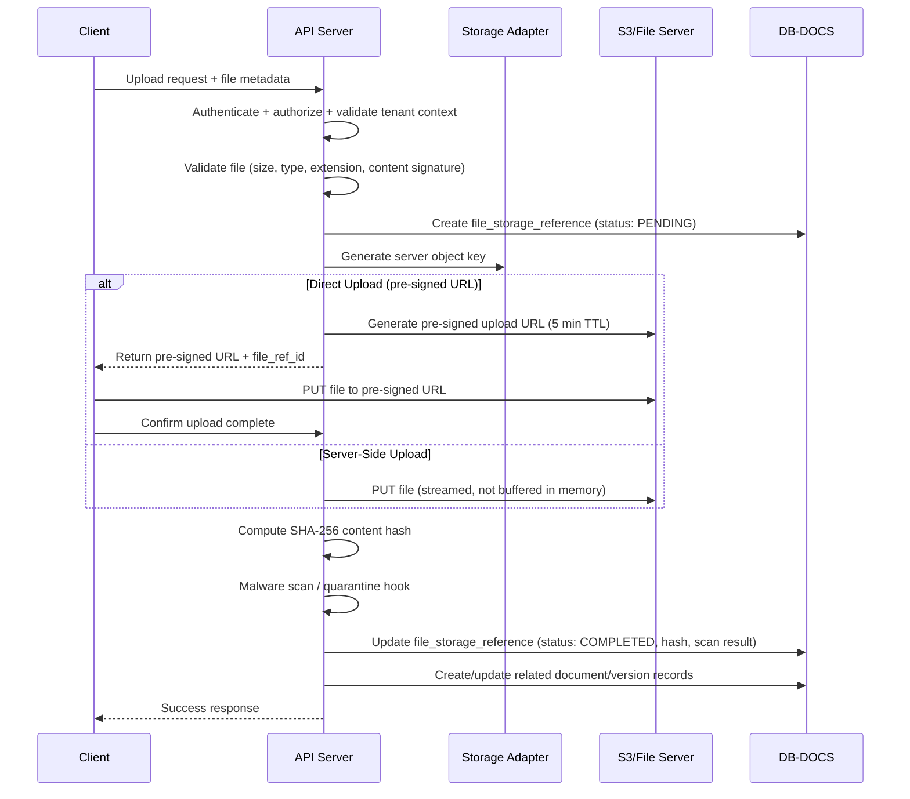
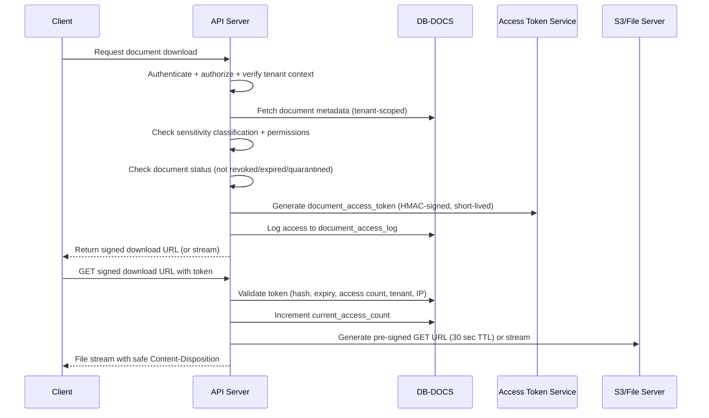

# Storage Architecture

## Purpose

Define the external file storage strategy, the `file_storage_references` bridge table, upload/download flows, tenant-isolated bucket structure, and provider abstraction.

## Core Principle

**Binary file content NEVER lives in any database.** All databases store only metadata and a `file_storage_ref_id` (UUID) pointing to the `file_storage_references` table in DB-DOCS. The actual bytes live in private object storage (S3, Azure Blob, GCS, or local file server).

## Separation

```text
┌─────────────────────┐     ┌──────────────────────┐     ┌──────────────────────┐
│  Any Database Table  │────▶│  file_storage_refs   │────▶│  External Storage    │
│  (stores UUID ref)   │     │  (DB-DOCS)           │     │  (S3/Azure/GCS/FS)   │
│                      │     │  - provider           │     │                      │
│  profile_image_      │     │  - bucket             │     │  Binary bytes live   │
│  storage_ref_id      │     │  - object_key         │     │  here ONLY           │
│                      │     │  - content_hash       │     │                      │
│                      │     │  - encryption_key_ref │     │                      │
└─────────────────────┘     └──────────────────────┘     └──────────────────────┘
```

## Storage Provider Abstraction

The system supports multiple storage backends via a provider enum:

| Provider | Value | Use Case |
|---|---|---|
| Amazon S3 | `S3` | Production primary |
| Azure Blob Storage | `AZURE_BLOB` | Azure deployments |
| Google Cloud Storage | `GCS` | GCP deployments |
| Local File System | `LOCAL_FS` | Development/testing only |

The application uses a **StorageAdapter** interface with implementations for each provider. All upload/download operations go through this adapter — no direct SDK calls from service code.

## Bucket / Object Key Structure

```text
{bucket}/{tenant_id}/{module}/{year}/{month}/{uuid}.{ext}

Example:
hrms-documents/550e8400-e29b-41d4-a716-446655440000/employee/2026/08/a1b2c3d4-e5f6-7890-abcd-ef1234567890.pdf
```

| Segment | Description |
|---|---|
| `bucket` | Top-level container. One bucket per environment: `hrms-documents-prod`, `hrms-documents-staging` |
| `tenant_id` | UUID. Provides first-level tenant isolation at the storage path level |
| `module` | Source module: `employee`, `onboarding`, `document`, `ticket`, `kb`, `tenant`, `platform` |
| `year/month` | Date-based partitioning for manageability |
| `uuid.ext` | Server-generated UUID filename with original extension. Original filename is NEVER used as storage key |

### Bucket Policy

- **Private by default**: No public access. All objects require authenticated access.
- **Per-tenant prefix**: IAM policies or bucket policies restrict service access to `{tenant_id}/*` prefix where possible.
- **No cross-tenant path traversal**: Object keys are server-generated. User-provided filenames are stored in `original_filename` metadata only.

## Upload Flow



### Upload Rules
- Server generates the storage key — client NEVER controls the path.
- Pre-signed URLs have a maximum TTL of 5 minutes.
- Storage upload is NOT automatically an accepted document — server finalization is authoritative.
- Content hash (SHA-256) is computed and stored for integrity verification on download.
- Malware scan runs before status transitions from `QUARANTINED` to `COMPLETED`.
- File size validated against `tenant_settings.max_file_upload_size_mb` AND platform hard ceiling.
- File type validated against `tenant_settings.allowed_file_types` AND MIME type + content signature.

## Download Flow



### Download Rules
- Authorize tenant-scoped metadata first — never expose object keys to the client.
- Verify sensitivity classification: `CONFIDENTIAL` and `HIGHLY_CONFIDENTIAL` documents require additional `document.view_sensitive` permission.
- Create short-lived signed delivery URL (30 seconds) or server-side stream.
- Use `Content-Disposition: attachment` for downloads. Never serve files inline unless explicitly safe (images for preview).
- Log every access attempt (success AND denial) to `document_access_log`.
- Verify SHA-256 content hash on download where integrity verification is required.

## Encryption

| Layer | Mechanism |
|---|---|
| In Transit | TLS 1.2+ for all API and storage connections |
| At Rest (Storage) | S3 SSE-KMS or SSE-S3 (provider-managed keys). Azure: SSE with customer-managed keys |
| At Rest (Database) | Database-level encryption (RDS encryption, Azure SQL TDE) |
| Per-Tenant Key | Optional: per-tenant KMS key for enhanced isolation. Key ARN stored in `encryption_key_ref`, never the actual key |

## Tenant Storage Quotas

- Total storage usage tracked per tenant via aggregation of `file_storage_references.file_size_bytes`.
- Quota limits defined in `tenant_subscription_plans.max_storage_gb`.
- Upload requests check remaining quota before accepting the file.
- Storage reports available to Tenant Admin and Super Admin.

## Versioning

Document versions are immutable. New file means new `document_version` row with a new `file_storage_ref_id` pointing to a new object in storage. Old versions remain accessible until explicitly revoked or retention policy triggers deletion.

## Deletion

### Logical Deletion
- `file_storage_references.deleted_at` is set. Object remains in storage.
- Document status set to `REVOKED` or `ARCHIVED`. Access tokens are revoked.
- Logical deletion is immediate and blocks all further access.

### Physical Deletion
- Background job processes `file_storage_references` where `deleted_at` is older than retention period.
- Physical deletion removes the object from S3/storage.
- Physical deletion must not break retained audit records — `document_access_log` entries remain.
- Retention periods are configurable per document category and sensitivity level.

## CDN / Edge Caching

- Phase 1: No CDN for documents (private by default).
- Public assets (tenant logos, platform branding) may use a CDN with cache-control headers.
- Future: CloudFront/CDN with signed cookies for authorized document delivery.
