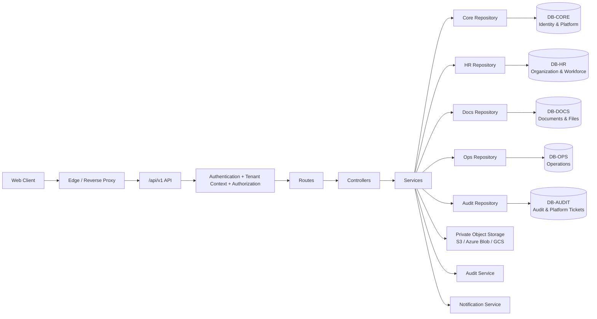

# System Architecture

## Purpose

Define Phase 1 component boundaries, trust boundaries, multi-database topology, external storage integration, and deployment shape.

## Logical Architecture

## Multi-Database Topology

The platform uses **5 independent databases** grouped by domain for fault isolation:

| Database | Responsibility | Failure Blast Radius |
|---|---|---|
| **DB-CORE** | Users, tenants, auth, RBAC | Login only — cached context keeps other services running |
| **DB-HR** | Employees, departments, onboarding | Employee CRUD — leave/attendance continue with cached refs |
| **DB-DOCS** | Documents, file metadata, access tokens | Document access only — all HR operations continue |
| **DB-OPS** | Leave, attendance, KB, tickets, facilities, notifications | Operational modules — login, employees, documents unaffected |
| **DB-AUDIT** | Audit logs, platform tickets | Audit/platform support — all business operations continue |

Cross-database JOINs are prohibited. Service-layer aggregation handles cross-domain data needs. See `database-architecture.md` for detailed patterns.

## External Storage

Binary files are stored in private object storage (S3-compatible API). The `file_storage_references` table in DB-DOCS serves as the bridge between database metadata and external storage. See `storage-architecture.md` for upload/download flows, bucket structure, and encryption.

## Phase 1 Deployment Shape

Use a modular monolith unless the existing codebase already establishes a different approved architecture. Domains remain explicit modules but share one backend runtime. Each database is a separate connection target — the monolith connects to all 5 databases. Private file storage is a separate external service (S3/file server).

## Domain Boundaries

| Domain | Database | Key Entities |
|---|---|---|
| Identity/Access | DB-CORE | Users, auth sessions, roles, permissions |
| Platform/Tenants/Consultants | DB-CORE | Tenants, settings, subscriptions, consultants |
| Organization/Employees | DB-HR | Regions, departments, designations, employees, employee details |
| Onboarding/Offer Letters | DB-HR | New hires, cases, tasks, offers, acknowledgements |
| Documents | DB-DOCS | Documents, versions, associations, file refs, access tokens |
| Leave/Holidays/Attendance | DB-OPS | Leave types/policies, requests, holidays, attendance, overtime |
| Knowledge/Announcements | DB-OPS | KB articles, categories, tags, announcements |
| Tickets (Intra-company) | DB-OPS | Department tickets, comments, activities |
| Tickets (Platform) | DB-AUDIT | Company-to-super-admin tickets |
| Facilities | DB-OPS | Buildings, floors, rooms, reservations |
| Notifications | DB-OPS | Templates, notification queue |
| Audit/Observability | DB-AUDIT | Audit logs |

## Trust Boundaries

1. Browser/client is untrusted.
2. Authentication proves identity only.
3. Tenant context is server-authorized — never trust client-provided tenant ID.
4. Service layer owns business authorization/invariants.
5. Repository owns tenant-scoped persistence within its assigned database.
6. Storage object keys are not authorization tokens — access requires valid `document_access_token`.
7. Cross-database references are application-validated, not DB-enforced.
8. Audit writes are fire-and-forget with fallback queue — never block business operations on audit.

## Extensibility

Cross-domain behavior should call stable services/contracts rather than directly manipulating another domain's tables. This supports later payroll, reporting, SSO and privacy functions. The multi-database architecture enables future microservice extraction if needed — each database can become a separate service boundary.
