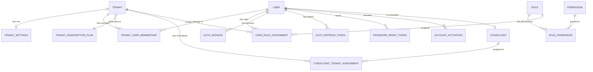
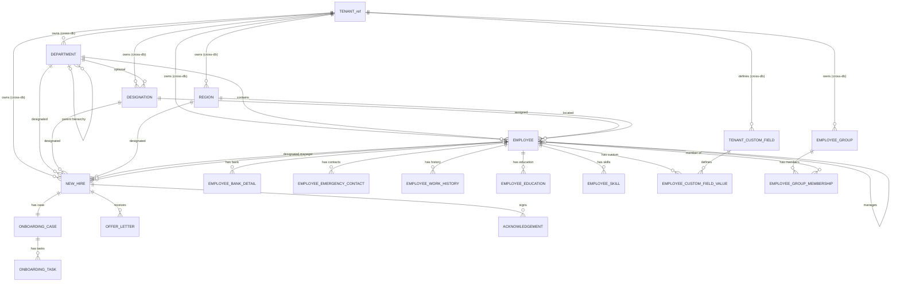
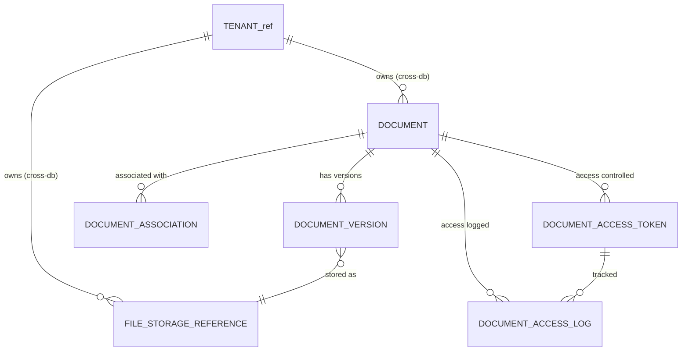
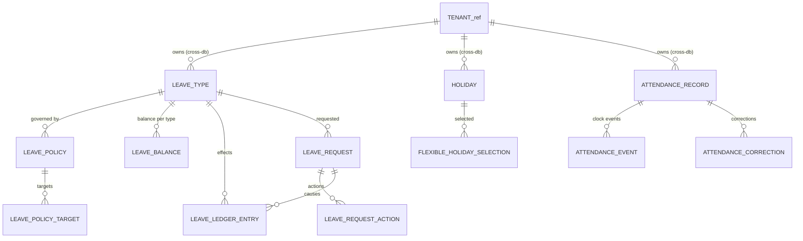
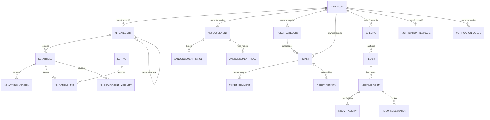
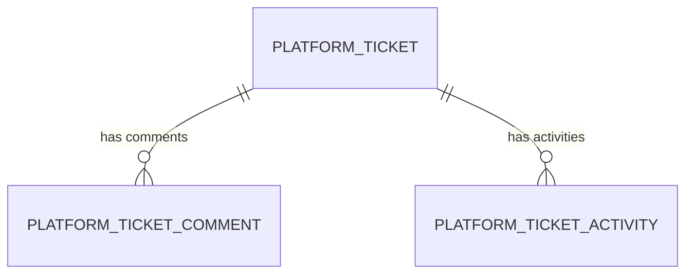

# Database Relationships

## Purpose

Define all entity relationships across the 5-database architecture, distinguishing between same-database FK constraints and cross-database application-enforced references.

## Relationship Legend

- **Solid lines** (`||--o{`): Same-database FK constraint enforced by the database.
- **Dashed groupings**: Cross-database logical references enforced by the service layer.

## DB-CORE Relationships

## DB-HR Relationships

## DB-DOCS Relationships

## DB-OPS Relationships (Leave/Attendance)

## DB-OPS Relationships (Content/Service/Facilities)

## DB-AUDIT Relationships

`audit_logs` is a standalone append-only table with no FK relationships.

## Cross-Database Reference Matrix

| Source Table (DB) | Referenced Table (DB) | Column | Enforcement |
|---|---|---|---|
| All tenant-owned tables (HR, DOCS, OPS, AUDIT) | `tenants` (CORE) | `tenant_id` | Service-layer validation |
| `employees` (HR) | `users` (CORE) | `user_id` | Service-layer validation |
| `new_hires` (HR) | `users` (CORE) | `user_id` | Service-layer validation |
| `onboarding_tasks` (HR) | `documents` (DOCS) | `document_id` | Service-layer validation |
| `offer_letters` (HR) | `documents` (DOCS) | `document_id`, `signed_document_id` | Service-layer validation |
| `employee_education` (HR) | `file_storage_references` (DOCS) | `certificate_storage_ref_id` | Service-layer validation |
| `employee_skills` (HR) | `file_storage_references` (DOCS) | `certificate_storage_ref_id` | Service-layer validation |
| `leave_requests` (OPS) | `employees` (HR) | `employee_id`, `approver_employee_id` | Service-layer validation |
| `leave_requests` (OPS) | `documents` (DOCS) | `supporting_document_id` | Service-layer validation |
| `attendance_records` (OPS) | `employees` (HR) | `employee_id` | Service-layer validation |
| `holidays` (OPS) | `regions` (HR) | `region_id` | Service-layer validation |
| `tickets` (OPS) | `employees` (HR) | `requester_employee_id`, `assignee_employee_id` | Service-layer validation |
| `tickets` (OPS) | `departments` (HR) | `department_id` | Service-layer validation |
| `ticket_comments` (OPS) | `documents` (DOCS) | `attachment_document_id` | Service-layer validation |
| `kb_department_visibility` (OPS) | `departments` (HR) | `department_id` | Service-layer validation |
| `room_reservations` (OPS) | `employees` (HR) | `booked_by_employee_id` | Service-layer validation |
| `buildings` (OPS) | `regions` (HR) | `region_id` | Service-layer validation |
| `platform_ticket_comments` (AUDIT) | `file_storage_references` (DOCS) | `attachment_storage_ref_id` | Service-layer validation |
| Various created_by/updated_by columns | `users` (CORE) | `user_id` | Context propagation |

## Critical Rules

- Employee department/designation/region/manager are same tenant — enforced by same-database FKs in DB-HR plus service-layer tenant check.
- Department parent/head are same tenant — enforced by same-database FKs.
- Manager and department-parent hierarchies are acyclic — enforced by service-layer graph validation.
- Onboarding/offer/document associations never cross tenant — enforced by service-layer tenant_id comparison.
- Leave policy targets and room hierarchy/reservations remain same tenant — enforced by service-layer cross-DB validation.
- Cross-database references always include tenant_id verification in both the source and target services.
