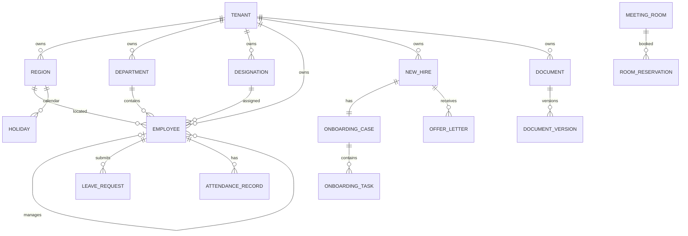

# Database Relationships

## Purpose
Define important relationships and tenant consistency.

## Critical rules
Employee department/designation/region/manager are same tenant. Department parent/head are same tenant. Manager and department-parent hierarchies are acyclic. Onboarding/offer/document associations never cross tenant. Leave policy targets and room hierarchy/reservations remain same tenant.
